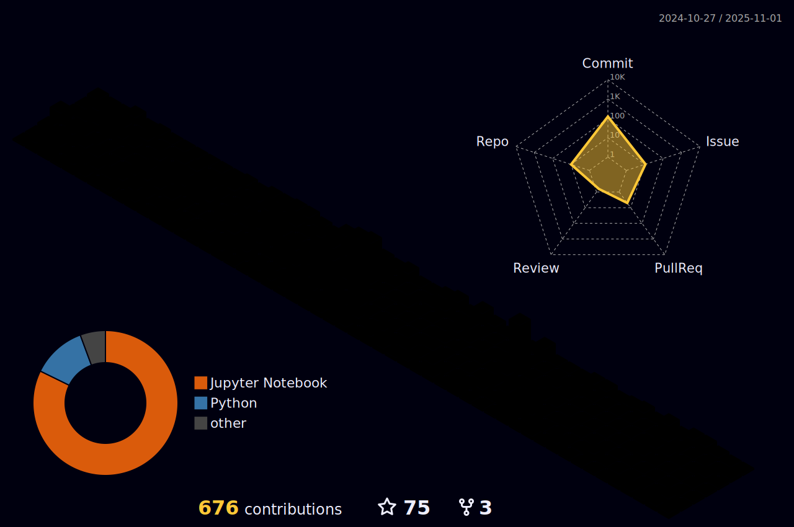

# 👋 Hi there, I'm Lucas Colas

I am a French student pursuing my third year in engineering school (french grande école). I like to work on software engineering, machine learning and game development.

## Programming languages

  

    &nbsp;
    &nbsp;
    &nbsp;
    &nbsp;
    &nbsp;
    &nbsp;
     
     
    &nbsp;
    &nbsp;
  

## Libraries / frameworks
&nbsp;
&nbsp;
&nbsp;
&nbsp;
&nbsp;

## Tools / software
&nbsp;
&nbsp;
&nbsp;
&nbsp;
&nbsp;
&nbsp;

## Stats

	

## Contact

<!--
**LucasColas/lucascolas** is a ✨ _special_ ✨ repository because its `README.md` (this file) appears on your GitHub profile.

Here are some ideas to get you started:

- 🔭 I’m currently working on ...
- 🌱 I’m currently learning ...
- 👯 I’m looking to collaborate on ...
- 🤔 I’m looking for help with ...
- 💬 Ask me about ...
- 📫 How to reach me: ...
- 😄 Pronouns: ...
- ⚡ Fun fact: ...
-->
